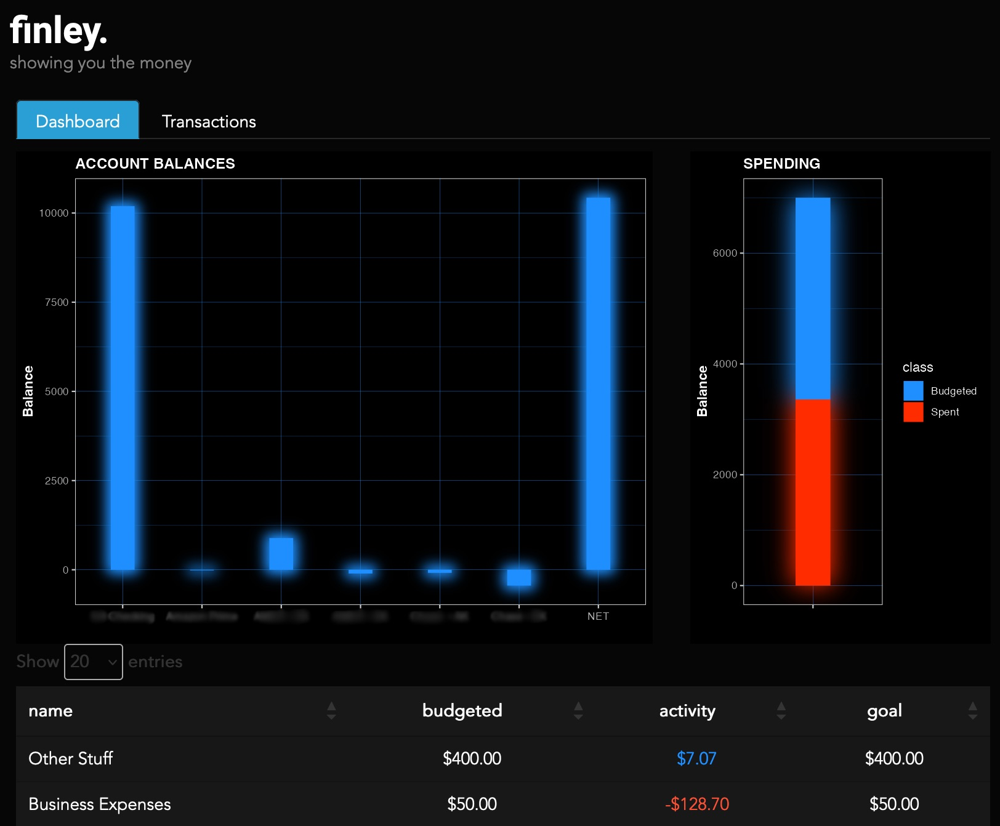

# finley

Finley provides a simple dashboard to view relevant information about your YNAB budget.

# Prerequisites

This app has the following dependencies:

    library(dplyr)
    library(shiny)
    library(shinythemes)
    library(ggplot2)
    library(ggfx)
    library(ggdark)
    library(DT)
    library(rnab) # remotes::install_github("https://github.com/ejkreboot/rnab")
    library(dotenv)

Dependencies can be checked, and missing packages installed, as follows:

    deps <- c(
      'dplyr',
      'shiny',
      'shinythemes',
      'ggplot2',
      'ggfx',
      'ggdark',
      'DT',
      'dotenv',
      'remotes'
    )

    ix <- which(!deps %in% installed.packages())

    if(length(ix) > 0) {
      install.packages(depx[ix])
    }

    if(!"rnab" %in% installed.packages()) {
      remotes::install_github("https://github.com/ejkreboot/rnab")
    }

# Usage

Update the provided `.env.ex` with your credentials and other information and save it as `.env`. Then from within an R session:

    shiny::runApp()
